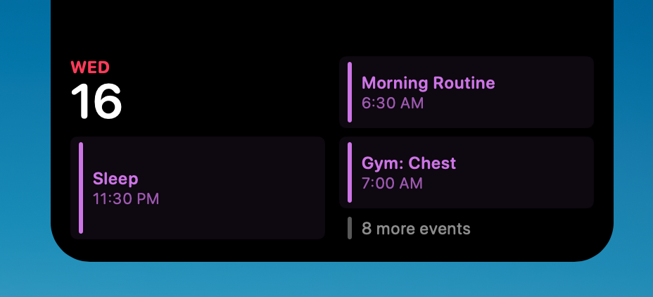
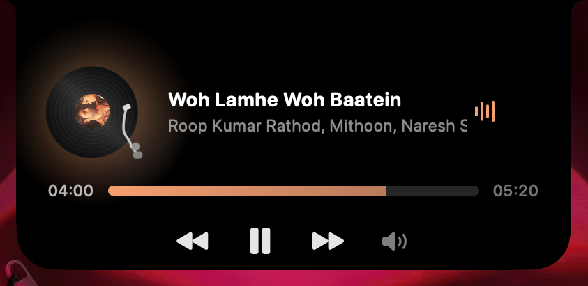
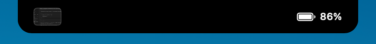

<div align="center">

# Visor

### The MacBook notch, turned into a Dynamic Island.

**Built in 26 hours.**

[](https://www.apple.com/macos/)
[](https://swift.org)
[](#power)
[](#built-with)
[](#build)
[](LICENSE)

<br />

*The black bar above your screen stops being dead space.*

Hover it and it grows into your music and your day. Move away and it disappears back into the hardware cutout — invisible, and costing nothing.

<br />


</div>

<br />

---

<br />

<div align="center">

## It lives in the notch

</div>

Not hovering? It sits *inside* the cutout itself — album art, live playback bars, battery. The real notch and the drawn shape are the same black.

<div align="center">

</div>

<br />

<table>
<tr>
<td width="50%" valign="top">

### Your day, at a glance

Nothing playing? The island becomes your agenda. Events are colour-matched to the calendar they came from, sorted soonest-first, with an overflow count for the rest.

An event stays listed until it has actually *ended* — something in progress right now doesn't vanish on you halfway through.

</td>
<td width="50%" valign="top">



</td>
</tr>
</table>

<br />

<table>
<tr>
<td width="50%" valign="top">



</td>
<td width="50%" valign="top">

### Vinyl mode

A record that actually turns, with the album art as its centre label. The tonearm is built the way a real one is — a counterweight behind the pivot, an S-curved tube, and a headshell canted at the 22° offset angle that puts a cartridge tangent to the groove.

It lowers into the lead-in groove when you press play and lifts to its rest when you pause. That's the whole play/pause tell: a still frame of a record can't say whether it's spinning.

A toggle in Settings, off by default — the cover is the honest representation of what's playing.

</td>
</tr>
</table>

<br />

<div align="center">

## Catch a screenshot

</div>

Take a screenshot anywhere on the system and it slides into the notch and waits a minute. Drag it straight into Slack or Figma, click to open it, or flick it away with the ✕. Drag an image *onto* the notch and it opens to take it.

<div align="center">

</div>

<br />

---

<br />

## What it does

### On the island

|  | |
| --- | --- |
| **Now Playing** | With a track loaded — playing *or paused* — the island is the player: artwork, title, artist, transport, scrub bar, shuffle, repeat, and a lyrics panel that only fetches while it's open. The cover flips like a card when the track changes. |
| **Your day** | With nothing loaded, the island is your agenda instead: the next events from your calendars, colour-matched to their source. The two never share the island. |
| **Screenshot shelf** | Every screenshot lands in the notch for a minute — up to four at once, each draggable straight into another app. |
| **Downloads** | Files arriving in `~/Downloads` show a row each with real progress, read from the same attribute Safari writes. No progress reported means an honest indeterminate bar, never a guessed number. |
| **AirDrop** | Hold <kbd>⌥</kbd> while dropping files on the island to send them. |
| **Screen recording** | A red dot and a running clock whenever the screen is being recorded or shared. |
| **Timer** | Presets from the idle island, deadline-based so nothing ticks behind a closed notch. |
| **Volume** | The system HUD, in the notch, with a draggable bar — and no permission prompt, because it listens to CoreAudio's result rather than watching your keys. |
| **Battery** | Percentage in the wing, a bolt that bounces the moment you plug in, and Low / Full alerts. |
| **Accessory battery** | AirPods and friends announce their charge when they connect. |
| **Bluetooth** | A peek when a device connects or drops. |
| **Network** | An offline alert, and a VPN indicator gated on the connection actually being up — not merely on a `utun` interface existing, which macOS creates for Handoff on a machine with no VPN at all. |
| **Focus** | A peek when Focus turns on or off. |
| **Greeting** | One "Good morning" a day, on the first idle after you log in. |

### On the lock screen

Lock the Mac and the island wears a padlock. If a track is loaded, a full player card appears on the lock screen — artwork, scrubbable progress, transport. Tap the artwork and it blows up to full screen with the clock above it and the cover drifting behind.

It shows up **only when there's something playing**. No track, no panel — there's no half-empty widget waiting for you.

The panel runs in its own window above the lock shield. The island's own panel stays pinned *below* it, where it has always been — an island that could paint over a locked screen is a security hole, not a feature.

### Everywhere

| | |
| --- | --- |
| **Capsule mode** | On a screen with no cutout, the same shape resolves symmetric corners and floats as a capsule. One shape morphing, never two cross-fading. |
| **Customisation** | Optional outline, ±16pt width and ±4pt height trims with live feedback, hide-in-fullscreen, display selection, and five animation speeds. |
| **Swipe to dismiss** | Push the island away with a two-finger swipe up; pull it back with a swipe down. |

<br />

## How it feels

One black shape morphs between closed, compact and expanded. Never a cross-fade between two views — the shape leads, and the content follows it in.

Every animation comes from one small set of motion tokens, so nothing in the app can invent its own timing. Reduce Motion is honoured everywhere, including mid-track: the card flip becomes a crossfade, the record stops turning, the bars go still.

The island is welded to the notch. Swipe between desktops and the desktops slide *underneath* it, the way the menu bar does — it doesn't ride along with the wallpaper.

<br />

## Power

<div align="center">

### 0.0% CPU while playing

**Not a target — a measurement**, taken with `sample` against a real track.

</div>

<br />

The rules that get it there:

- **Event-driven only.** No polling loops, no global mouse monitors.
- **Nothing animates or ticks** when it isn't visible, isn't playing, or the display is asleep.
- **Never animate a layout property in a loop.** The playback bars are `CALayer` + `CABasicAnimation`, handed to the render server once and costing the main thread nothing. The SwiftUI version of the same four bars cost 5% CPU, because animating `frame(height:)` re-ran the view graph every frame.
- **Observe, don't re-check.** A loop that sleeps to ask "has it changed yet" is a poll no matter how long the sleep.
- **Accessibility settings are cached, not queried.** Reading Reduce Motion is a round-trip to the accessibility server, so it never happens from a view body.
- **Artwork is decoded once per track** and downsampled with ImageIO.
- **The store compares before it writes,** so the adapter's constant position updates re-render nothing.
- **Cursor parallax only re-renders** when the album card is actually on screen, and only once the cursor has moved far enough to see it.

<br />

## Gestures

| Gesture | Does |
| --- | --- |
| Hover the notch | Expand |
| Two-finger swipe sideways | Previous / next track |
| Two-finger swipe up | Dismiss whatever the island is showing |
| Two-finger swipe down | Bring it back |
| Double-click | Play / pause *(on the island's surface — buttons keep their own clicks)* |
| Right-click | Settings |
| Drag a file onto it | The notch opens and takes it |
| <kbd>⌥</kbd> + drag a file onto it | Send it via AirDrop |
| Drag the thumbnail out | Drops the screenshot into any app |

Swipes lock to whichever axis you commit to first, so a diagonal flick can change the track *or* dismiss the island — never both.

<br />

## Requirements

- Apple silicon, macOS 14 or later
- A MacBook with a notch — or any other screen, where the island becomes a floating capsule
- [XcodeGen](https://github.com/yonaskolb/XcodeGen) — `brew install xcodegen`

<br />

## Download

Built disk images live in [`new-releases/`](new-releases), named `Visor-<version>-build<n>-<date>-<time>-<commit>.dmg`. Versions follow [semantic versioning](https://semver.org); the **build number** is what orders them, since `1.5.1` sorts after `1.6.0` alphabetically but came before it. Grab the highest build and open it: the disk image opens onto a window with Visor on the left, an Applications shortcut on the right, and an arrow between them — drag one onto the other.

Old builds are never deleted — see [`CHANGELOG.md`](CHANGELOG.md) for what landed in each.

Builds are ad-hoc signed, so macOS quarantines a downloaded image. After copying it across:

```bash
xattr -dr com.apple.quarantine /Applications/Visor.app
```

<br />

## Build

```bash
xcodegen generate
xcodebuild -scheme Visor -configuration Debug build
```

Or package a local `.dmg`:

```bash
./scripts/make-dmg.sh
```

Drag it to `/Applications` and launch. Visor lives entirely in the notch — no Dock icon, no menu bar item, nothing to close.

> [!NOTE]
> Calendar permissions are bound to the app's code signature. Add an Apple ID in **Xcode → Settings → Accounts** (the free tier is enough) and set `DEVELOPMENT_TEAM` in `project.yml`, or macOS will forget the grant on every rebuild.

<br />

## Permissions

Visor asks for **one** permission: Calendar, and only so the agenda has something to show. Say no and everything else still works.

Nothing else here needs a prompt, and that is a design constraint rather than a happy accident. Several features were cut or rebuilt to keep it:

- **Volume** listens to CoreAudio's *result*, not your keypresses. A media-key HUD would need a global event tap and Accessibility access.
- **Bluetooth** reads the connect/disconnect notification's own payload. Enumerating paired devices is privacy-gated and would prompt — for a name macOS is already handing over.
- **Focus** reports on and off only. Naming the active mode means Full Disk Access and parsing an undocumented database.
- **Downloads** reads a public extended attribute. It does not open your browser's history.
- **Notifications are not mirrored** at all, for the same reason.

Where a feature could not be built honestly without a permission it didn't deserve, it was left out rather than shipped as something that guesses. The full reasoning is in [`docs/RESEARCH.md`](docs/RESEARCH.md).

<br />

## Tech stack

| | |
| --- | --- |
| **Language** | Swift 6, language mode 6, strict concurrency `complete` |
| **UI** | SwiftUI for every view; AppKit confined to `Window/` and `App/` |
| **State** | One `@Observable @MainActor` store. Views read, services write. Combine appears only *inside* services that merge several system signals, never in the view layer. |
| **Platform** | macOS 14+, Apple silicon. App Sandbox off (it spawns the media adapter), `LSUIElement` |
| **System frameworks** | EventKit, CoreAudio, IOKit, Network, SystemConfiguration, FSEvents, ImageIO, Core Animation |
| **Private frameworks** | SkyLight, for pinning the island above the desktop and the lock overlay above the shield. Every symbol is resolved at runtime — a macOS that renames one degrades the feature instead of crashing the app. |
| **Project** | XcodeGen (`project.yml` is the source of truth; the `.pbxproj` is generated) |
| **Tests** | Swift Testing — 158 covering geometry, layout maths, activity priority, adapter parsing, gesture axis locking and alert edge detection |
| **Tooling** | SwiftFormat, SwiftLint |
| **Dependencies** | One: [`mediaremote-adapter`](https://github.com/ejbills/mediaremote-adapter) for Now Playing metadata |

<br />

## Architecture

One store, one shape, and a service per feature — a feature never imports another feature.

```
Visor/
├── Core/          NotchStore, Activity ladder, IslandLayout, Motion tokens
├── Window/        NotchPanel, NotchShape, geometry, SkyLight pinning
├── Features/      One folder per feature: service + models + views
├── UI/            The expanded and compact views the island fills itself with
└── App/           AppDelegate, Settings
```

Every service conforms to `NotchService` with `start()` / `stop()`, and `stop()` must release every process, observer and run-loop source. Every animation comes from `Motion`, so no feature can invent its own timing. Every size is a *delta from the measured cutout*, so the same layout lands correctly on any notch.

The full design record, including every decision that was tried and reversed, lives in [`docs/RESEARCH.md`](docs/RESEARCH.md).

<br />

## License

[GPL-3.0](LICENSE). Copyright © 2026 Apurva Mukherjee.

Visor is GPL-3.0 specifically so code from GPL-3.0 reference projects can be ported into it rather than only read for ideas. Any redistribution of the source must stay GPL-3.0-compatible.

<br />

---

<div align="center">

**by Apurva**

</div>
