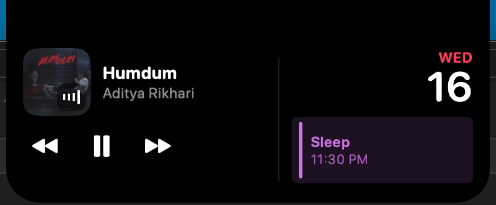
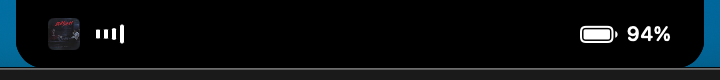

# Notchy

The MacBook notch, turned into a Dynamic Island.

Hover it and it grows into your music and your day. Move away and it disappears back into the hardware cutout — invisible, and costing nothing.



Not hovering? It sits in the notch itself: album art, live playback bars, battery.



---

## What it does

- **Now Playing** — artwork, title, artist and transport for whatever's playing, in any app. The album cover flips like a card when the track changes.
- **Your day** — the next events from your calendars, colour-matched to the calendar they came from.
- **Battery** — percentage in the wing, and a bolt that bounces the moment you plug in.
- **Playback bars** — four capsules bouncing in staggered phase while the music plays, and they stop dead when it pauses.

## How it feels

One black shape morphs between closed, compact and expanded — never a cross-fade between two views. The shape leads and the content follows it in. Every animation comes from one small set of motion tokens, and Reduce Motion is honoured everywhere, including mid-track.

The island is welded to the notch. Swipe between desktops and the desktops slide underneath it, the way the menu bar does — it does not ride along with the wallpaper.

## Power

**0.0% CPU while playing.** Not a target — a measurement, taken with `sample` against a real track.

The rules that get it there:

- Event-driven only. No polling loops, no global mouse monitors.
- Nothing animates or ticks when it isn't visible, isn't playing, or the display is asleep.
- Never animate a layout property in a loop. The playback bars are `CALayer` + `CABasicAnimation`, handed to the render server once and costing the main thread nothing. The SwiftUI version of the same four bars cost 5% CPU, because animating `frame(height:)` re-ran the view graph every frame.
- Artwork is decoded once per track and downsampled with ImageIO.
- The store compares before it writes, so the adapter's constant position updates don't re-render anything.

## Gestures

| Gesture | Does |
| --- | --- |
| Hover the notch | Expand |
| Two-finger swipe | Previous / next track |
| Double-click | Play / pause |
| Right-click | Settings |

## Requirements

- A MacBook with a notch, on Apple silicon
- macOS 14 or later
- [XcodeGen](https://github.com/yonaskolb/XcodeGen) (`brew install xcodegen`)

## Build

```bash
xcodegen generate
xcodebuild -scheme Notchy -configuration Debug build
```

Or package a local `.dmg`:

```bash
./scripts/make-dmg.sh
```

Drag it to `/Applications` and launch. It lives entirely in the notch — no Dock icon, no menu bar item.

> Calendar permissions are bound to the app's code signature. Add an Apple ID in Xcode → Settings → Accounts (the free tier is enough) and set `DEVELOPMENT_TEAM` in `project.yml`, or macOS will forget the grant on every rebuild.

## Built with

Swift 6 with strict concurrency, SwiftUI for every view, AppKit confined to the window layer. No third-party dependencies beyond the Now Playing adapter.

by Apurva
